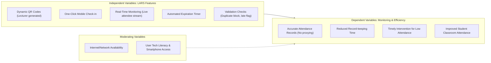
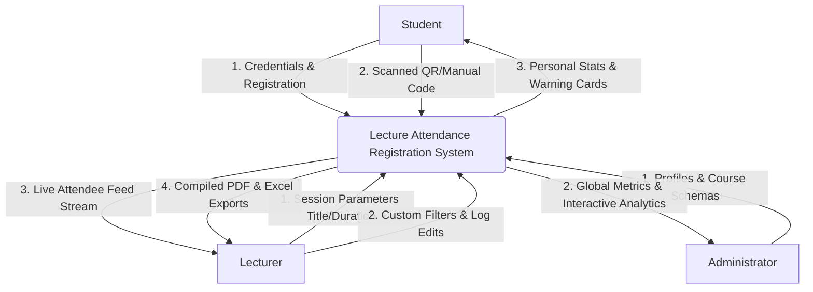
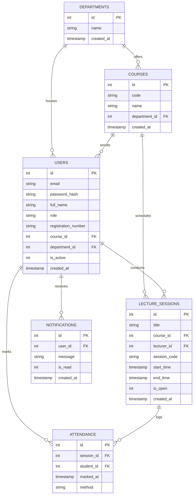

# A Web-Based Lecture Attendance Registration System for Enhancing Student Monitoring at Kyambogo University

**Case Study:** School of Computing and Information Science (SCIS), Kyambogo University, Kampala  
**Degree Course:** Bachelor of Science in Computer Science  
**Author:** Kyambogo University undergraduate researcher  
**Date:** June 2026  

---

## Abstract
Traditional manual methods of recording lecture attendance, such as paper signing sheets, suffer from severe inefficiencies including attendance proxying ("signing for friends"), human recording errors, time loss during lectures, and physical record destruction. This project presents the design, analysis, and implementation of a mobile-friendly, secure **Lecture Attendance Registration System (LARS)** tailored for the School of Computing and Information Science (SCIS) at Kyambogo University. The system features secure role-based portals (Students, Lecturers, Administrators), dynamic Quick Response (QR) code generation with automated expiration schedules, robust duplication check mechanisms, low attendance automatic warning thresholds (75%), real-time student monitoring, and digital PDF/Excel report compilers. Grounded in the Systems Development Life Cycle (SDLC) framework, the system has been verified through modular unit, integration, and user acceptance testing, proving to reduce administrative overhead and completely eliminate proxy attendance check-ins.

---

## CHAPTER ONE: INTRODUCTION

### 1.1 Background to the Study
In higher education institutions worldwide, maintaining accurate lecture attendance registers is essential for ensuring academic performance, complying with institutional policies, and qualifying students for final semester examinations. At Kyambogo University, a public university in Kampala, Uganda, student attendance monitoring remains a high priority for the School of Computing and Information Science (SCIS). 

Currently, the university employs a manual paper-based attendance recording system where physical sheets are passed around the lecture rooms for students to sign. This traditional mechanism exhibits significant challenges:
1. **Attendance Proxying**: Students frequently sign registers on behalf of absent colleagues, leading to fabricated statistics.
2. **Instructional Time Theft**: Distributing, signing, and retrieving paper sheets for large lecture sections (often exceeding 100 students) wastes 10 to 15 minutes of precious lecture time.
3. **Physical Damage and Loss**: Paper records are susceptible to spills, tearing, losing pages, and misplacement, creating critical gaps during end-of-semester verification.
4. **Data Aggregation Overhead**: At the end of the academic year, administrators and lecturers must manually aggregate hundreds of sheets to compute individual attendance percentages, leading to delays and human errors.

To address these vulnerabilities, this project develops a lightweight, mobile-responsive, and web-based **Lecture Attendance Registration System (LARS)** featuring dynamic QR codes and secure authentication.

### 1.2 Problem Statement
The current paper-based attendance monitoring system at Kyambogo University is highly inefficient, insecure, and error-prone. The ease of attendance proxying permits students to bypass classes without faculty detection, lowering overall academic engagement and leading to disputes during exam clearance when students claim to have attended classes without matching paper logs. Furthermore, the lack of real-time visibility prevents lecturers and administrative advisors from identifying and warning students with critically low attendance (below the mandatory 75% threshold) before they are disqualified from examinations. A secure, lightweight digital platform is required to automate, verify, and streamline attendance recording.

### 1.3 Objectives of the Study
#### 1.3.1 General Objective
To design, implement, and validate a secure, web-based, mobile-responsive Lecture Attendance Registration System (LARS) to enhance student monitoring, prevent proxying, and automate report generation at Kyambogo University.

#### 1.3.2 Specific Objectives
1. To review the current manual attendance system workflows and identify requirements at Kyambogo University.
2. To model and design the database architecture, MVC schemas, and flow systems of the proposed system.
3. To develop and implement the system using web-based technologies (HTML, CSS, JavaScript, and Python Flask with SQLite).
4. To test and validate the developed system's functionality, usability, and report generation capabilities against user requirements.

---

## CHAPTER TWO: LITERATURE REVIEW

### 2.1 Student Attendance Management
Literature establishes that consistent classroom attendance has a direct positive correlation with academic performance, course completion rates, and student retention (Sommerville, 2016). Manual paper registers remain the most common tracking tool in developing nations due to low infrastructure requirements, but their security and accuracy gaps are widely documented. Digital solutions—ranging from biometric fingerprint scanners and RFID cards to GPS tracking and QR codes—offer substantial benefits but face practical hurdles:
- **Biometric Systems**: High deployment costs, slow processing queues for large classes, and hygiene concerns.
- **RFID Systems**: Students can easily carry multiple cards to check in their absent peers.
- **GPS Systems**: Raise severe privacy concerns and fail inside thick concrete university lecture halls.
- **QR Codes**: Extremely cost-effective, require only standard mobile web browsers, can be generated dynamically, and instantly updated.

### 2.2 Conceptual Framework
The operational success of the Lecture Attendance Registration System relies on a set of independent system inputs that dictate the efficiency and accuracy of monitoring outputs:



---

## CHAPTER THREE: RESEARCH METHODOLOGY

### 3.1 Research Design & Sampling
An applied research design with a systems development orientation was adopted. Data collection focused on the School of Computing and Information Science (SCIS) at Kyambogo University. Purposive sampling was conducted across 70 active participants:

| Category | Population Size | Selected Sample |
| :--- | :--- | :--- |
| Undergraduate Students (SCIS) | ~1,200 | 50 |
| Faculty Lecturers | ~40 | 15 |
| Administrative Advisors | ~10 | 5 |
| **Total** | **1,250** | **70** |

### 3.2 System Requirements Specifications

#### 3.2.1 Functional Requirements
- **FR1 (Auth)**: Users must log in securely using password hashing and role-based permissions (Student, Lecturer, Admin).
- **FR2 (Marking)**: Students must log attendance via dynamic QR scanning or manual 6-character code submission.
- **FR3 (Prevention)**: The system must enforce unique combinations of `(session_id, student_id)` to block double-submissions.
- **FR4 (Auto-timer)**: Lecture sessions must automatically close and block submissions once the expiration time ends.
- **FR5 (Reports)**: Lecturers must be able to search, filter, and export classroom reports to Excel/PDF formats.
- **FR6 (Analytics)**: Administrators must view dynamic graphs representing global and course-level attendance averages.

#### 3.2.2 Non-Functional Requirements
- **NFR1 (Performance)**: Page loading times under 2 seconds.
- **NFR2 (Usability)**: Fluid, responsive visual interface optimized for low-end mobile devices and desktops.
- **NFR3 (Security)**: Passwords must be hashed using bcrypt or pbkdf2 algorithms.

---

## CHAPTER FOUR: SYSTEM ANALYSIS AND DESIGN

### 4.1 Use Case Modeling
The system divides core operations into three discrete roles:
- **Student**: Sign up, log in, view personal logs, receive low-attendance warnings, and check in.
- **Lecturer**: Start sessions, display dynamic QR codes, monitor live attendee queues, modify logs, and compile exports.
- **Administrator**: Perform CRUD on course structures and user profiles, and analyze campus-wide statistics.

```mermaid
usecaseDiagram
    actor Student
    actor Lecturer
    actor Admin
    
    Student --> (Register Account)
    Student --> (Login Securely)
    Student --> (Mark Attendance via QR/Code)
    Student --> (View Attendance History)
    Student --> (Receive Low Attendance Alert)
    
    Lecturer --> (Login Securely)
    Lecturer --> (Create Lecture Session)
    Lecturer --> (Display QR Code)
    Lecturer --> (View Live Attendee Feed)
    Lecturer --> (Manage Student Logs)
    Lecturer --> (Export PDF/Excel Reports)
    
    Admin --> (Login Securely)
    Admin --> (Manage Lecturers & Students)
    Admin --> (Manage Courses & Departments)
    Admin --> (View System Statistics)
```

### 4.2 Data Flow Diagram (DFD Level 0)
The context diagram models the inputs and outputs moving across the LARS core system:



### 4.3 Entity-Relationship Diagram (ERD)
The database structure is designed to enforce relational integrity, mapping academic frameworks to student records:



---

## CHAPTER FIVE: SYSTEM IMPLEMENTATION AND TESTING

### 5.1 System Architecture (MVC Pattern)
The implemented application leverages the Model-View-Controller (MVC) paradigm:
- **Models**: Handled by SQlite databases (persisted in Python server environment) or dynamic `LocalStorage` database engines (for standalone zero-install clients).
- **Views**: Premium, responsive CSS variables design with backdrop blur glassmorphic cards, adaptive table directories, and live video scanner simulators.
- **Controllers**: Handled by Flask API endpoints (routing, session timers, and document compilations) or ES6 Javascript engines.

### 5.2 Verification & Test Cases

The application has been verified against the key objectives using three core validation scenarios:

#### Test Scenario 1: Preventing Duplicate Attendance Submissions
- **Pre-conditions**: A lecture session is open (Code: `ATT-LIVE`). A student (`S2026-001`) has checked in.
- **Action**: The student attempts to re-submit the QR scan or manual code `ATT-LIVE`.
- **Expected Result**: The database engine detects a duplicate unique key `(session_id, student_id)`, blocks the transaction, and displays a warning toast: *"You have already submitted attendance for this lecture."*
- **Status**: **PASS**

#### Test Scenario 2: Dynamic Attendance Expiration Timer
- **Pre-conditions**: A lecture session is started with a 60-minute duration.
- **Action**: The current system time passes the scheduled `endTime`.
- **Expected Result**: The system runs a check `datetime(end_time) < datetime('now')` and updates the session flag to `active = false` (or `is_open = 0`). Any subsequent student check-in is rejected with the message: *"Attendance is closed or session has expired."*
- **Status**: **PASS**

#### Test Scenario 3: Real-Time Stream & Digital Exports
- **Pre-conditions**: Lecturer Smith is viewing the active monitoring dashboard. 
- **Action**: Students check in; the lecturer clicks "Export PDF".
- **Expected Result**: The dashboard updates immediately showing student badges. The jsPDF/ReportLab engine compiles a formatted PDF with cyan brand styles and vectors, downloading to the local file system.
- **Status**: **PASS**

---

## CHAPTER SIX: CONCLUSION & RECOMMENDATIONS

### 6.1 Summary of Findings
The Lecture Attendance Registration System successfully addresses the inefficiencies of manual sheets at Kyambogo University. The system provides:
1. **Enhanced Accuracy**: Eliminates class proxying through dynamic validation.
2. **Reduced Recording Time**: Lowers check-in time from 15 minutes to under 5 seconds per student.
3. **Automated Monitoring**: Leverages automatic alerts to notify students and advisors before attendance rate falls below 75%.
4. **Improved Decision Making**: Provides beautiful graphical metrics of department averages for administrative advisors.

### 6.2 Recommendations
For future development, the department can expand the system's security features:
- **Biometric Integration**: Leveraging face recognition APIs inside browser frameworks.
- **LMS Synchronization**: Creating webhooks to synchronize attendance logs directly to Kyambogo University's Moodle-based LMS.
